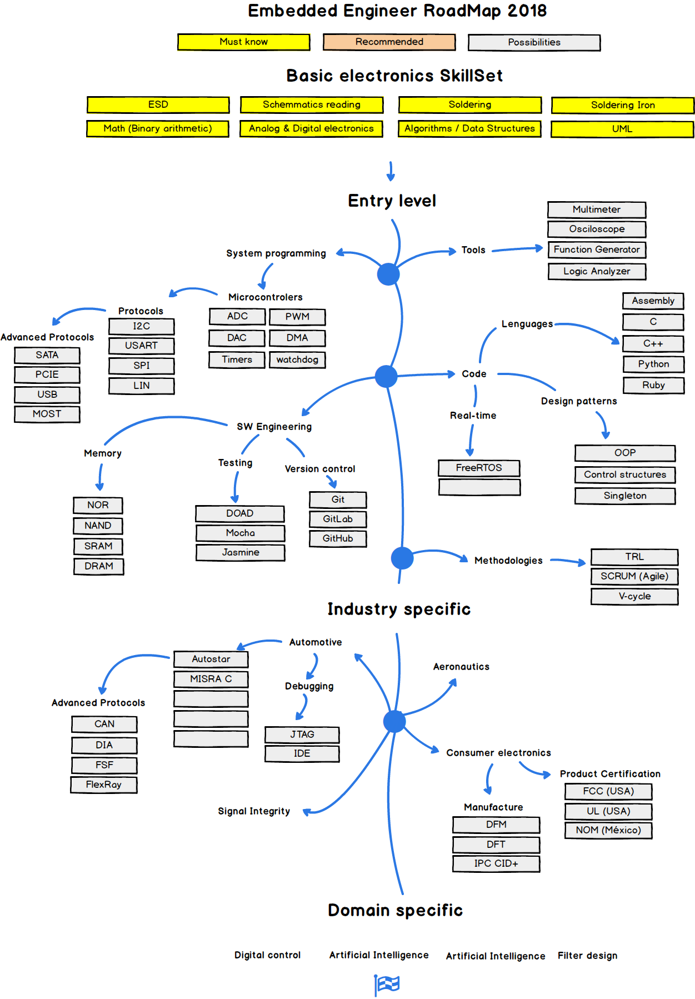
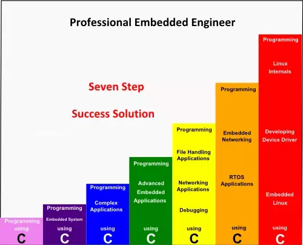

# 임베디드 개발자 로드맵

사실 관련된 자료 찾기가 쉽지 않았다. 자료가 많지도 않다. 그래서 최대한 최신 자료로 관련성 있는 부분들만 발췌해 보았다. 앞으로 나 뿐만 아니라 이쪽 분야를 생각하는 나 같은 대학생들이 공부하는데에 작은 도움이 되었으면 좋겠다.

- 출처 : https://github.com/vazeri/Embedded-Engineering-RoadMap-2018

### 펌웨어 개발자 로드맵
 

### 펌웨어 개발자가 갖추어야할 역량
 

