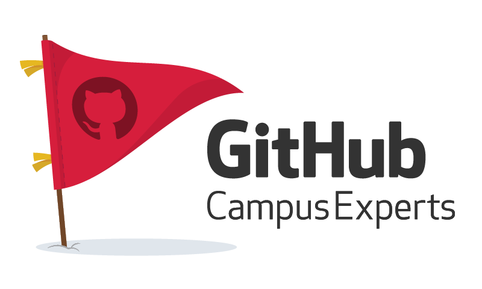

# 🚩GITHUB CAMPUS EXPERT PROGRAM 2021.08 Batch 모집이 시작되었습니다🚩

 

 

안녕하세요! 이 글을 봐주시는 분들이 계시다면 우선 감사합니다...! 아마 이 글이 구글 검색에 뜨게 된다면 정말 영광이겠군요...ㅎㅅㅎ..... 😊 정말 일기장 수준인 블로그에서 짧게나마 제 솔직한 경험담과 후기 그리고 꿀팁을 남기고자 `GITHUB CAMPUS EXPERT` 관련 글을 순차적으로 업로드 해보려고 해요! 사실, 선발되자마자 바로 글로 남겼어야 했는데,😅 ~~귀차니즘~~ 때문에 당장 2021.08 배치 마감 3주도 안 남은 시점에 약 3편에 걸쳐 프로그램 관련 정보와 경험 글을 올려보려고 합니다.🚀
 
---

 

 

이 글을 읽고 계신 분들이라면(~~정말 먼 길 오셨습니다!~~) 아시겠지만, `GITHUB CAMPUS EXPERT` 프로그램에 대한 자세한 정보... **특히 한글 자료**의 경우... 정말정말! ~~귀합니다~~ 많이(정말 많이) 없습니다. 저도 지원 당시에 그랬구요!! 프로그램 관련 유튜브 영상이며, 해외 엑스퍼트 분들의 모든 글들까지 전부!!! 다 읽어봤다고 자부할 정도로 정말 많이 자료 검색을 했었는데, 지원 마감 당시까지도 정보가 많이 없어서 아쉬웠던 경험이 있습니다. 근데 저는 정말 감사하게도, 지원할 당시에 제게 도움을 주신 분들이...💪🏼 3분이나 계셨어요!!! (이 부분은 다음 포스팅에 적어볼게요!ㅎㅎ🙆🏼‍♀️)

 

따라서 현재 `GITHUB CAMPUS EXPERT`로 활발한 활동을 이어나가는 저로서, 프로그램에 관심이 있는 분들께 도움을 드리고자 하는 마음에 적어보려고 해요! 😊 우선 저는 올해 2021년 4월 Batch에 우연한 기회로 정말 운 좋게 합격해서 국내 최초(!!!!!) 🇰🇷🇰🇷 라는 정말 영광스러운 타이틀과 함께 너무 값진 경험들을 많이 했고, 현재진행형으로 다양하게 배우고 즐기며 활동에 임하고 있습니다! 나름 블로그를 알차게 구성하고자했던 제 초심과는 달리, 한번 글을 쓰게 되면 각종 TMI와 주접이 계속 나와서 주체를 못하고 글이 자꾸 방향성을 잃게 되는 경우가 많은데, 이번은 `GITHUB CAMPUS EXPERT` 관련 글의 의미 있는 🎉첫 글🎉을 장식하는 포스트인만큼, 여기까지만 제 사담을 마치고 가장 중요한 포인트들 부터 적을게요! 그리고 다음 시리즈 글부터 정말 제 생각을 구체적으로 담아 도움이 될만한 글들로 찾아뵙겠습니다!! ~~블로그를 지금껏 제 기록용으로 썼던거라, 독자를 위한 글을 쓰려니 말투도 어색하고 낯서네요 ㅎㅎ~~

---

 

## 모집 기간

 

 

8월 9일부터 8월 프로그램 신청자들을 모집합니다! Pacific time으로 8월 29일 22시까지입니다! 한국 시간 KST로 계산하면 8월 30일 14시까지네요!! (괜히 시간 번 느낌(?)) 저도 당시에 마지막까지 꼼꼼히 지원서 다시 검토해보고 재검토하느라 시간이 꽤 걸렸는데, 한국 시간 기준으로 계산해서 시간을 그나마 여유롭게 두고 새벽 즈음에 제출했던 기억이 있습니다...!!! 이럴때만 시차에 감사하네요 😂😂

---

 

## GitHub Campus Expert 깃헙 캠퍼스 엑스퍼트란?

 

2016년부터 시작된 `GitHub Campus Expert Program` a.k.a. `GCE` `깃헙 캠퍼스 엑스퍼트`는 현재 5년째 전 세계적으로 활발하게 진행되고 있고 지금까지 약 250여명 이상의 학생들을 지원했습니. 다양한 전공, 분야 백그라운드를 지닌 학생들이 참여하지만, 공통적으로 **기술🛠💻🎛**에 관심이 많은 학생들이 참가한다는 점이 있습니다. 저희는 다양한 행사, 온라인 밋업, 컨퍼런스 해커톤등을 주최하여 리딩하는 수단을 통해 여러 최신 기술들을 향한 열정을 표현합니다! 그리고 이 기술적인 관심을 바탕으로 다양한 학생들 그리고 커뮤니티를 이끄는 역할을 하기도 합니다.

 

따라서 저희 역할은 이런 열정과 관심을 갖고 로컬 커뮤니티를 서포트하고 이끄는 것과 더불어 관련된 다양한 단체들을 활성화시키고 더 발전시키려고 노력합니다. 현재 산업에 이루어지는 다양한 분야와 학생들이 속한 캠퍼스 간 분야를 좁히기 위해 최선을 다합니다. 이를 위해서 학생들에게 기술적인 도움을 줄 수 있는 다양한 워크샵, 세션등을 운영하기도 하고, 그 밖에 관련한 개별적인 문제점들에 대한 해결책을 내세우기 위해 노력합니다.

 

 

말 그대로 저희는 기술 커뮤니티를 활성화 시키고 더 발전시키기 위해 노력하는 리더들입니다! 이 프로그램을 통해 전세계 학생들과 교류하기도 하고, 캠퍼스 내 뿐만 아니라 다양한 영역에서 활동하며 발전된 기술을 알리고 많은 사람들이 기술을 통해 조금 더 많은 도움을 얻을 수 있도록 지원합니다.

 

 

현재 글로벌하게 각국에서 활동 중인 다양한 GCE분들입니다...!! 자자 여기서 살짝 확대를 해보자면,

 

 

한국에는 저까지 총 두명! KAIST에 재학 중이신 외국인 Campus Expert 한분과 한국인인 제가 있습니다!!

 

### 이 글을 읽고 계신 분들, 꼭 지원하셔서 한국에 많은 깃발🚩들을 더 꽂아주세요!!!

 

---

 

## 지원 자격

 

 

지원할 수 있는 자격은 크게 **다섯가지**로 나뉩니다!
1. [GitHub Student Developer Pack](https://education.github.com/pack)에 등록된 GitHub 유저이어야 합니다.

    - 이 패키지가 필요한 이유는, **학생 신분을 증명**하는 과정이 필요하다고 해서 그렇다고 하네요! 실제 패키지 등록할때는 학교 이메일 도메인 등으로 학생 신분임을 확인받습니다.
2. 만 18세 이상이어야 하고,
    - 한국 대학생의 경우 거의 모두 이 조건에 부합할거라 생각해요!
3. 고등 기관 이상에 등록된 학생 (대학교, 대학원)
4. 지원하는 시점이 졸업 예정일보다 1년 이상 남은 상태여야 합니다.
5. GitHub 계정을 **최소 6개월**이상 보유한 유저여야 합니다!

    - 헉! 그런데 만약 이번에 새로 계정을 만드신 학생 분이시라면, 다음 Batch인 **2022년 2월**에 지원하면, 6개월 이상 유저 조건에 부합할 수 있으니, 그때 재지원해보시는 것도 좋을 것 같네요!😭 ~~너무 걱정말고! 아쉽지만 다음 기회에!!~~ __Don't give up!!💪🏼__

 

 

**위 다섯가지** 조건에 부합하시는 분들이라면, 이번 기회에 꼭!!👍🏼 지원해보세요!!!! 🚀🚀

---

 

## 모집 절차

모집하는 절차도 크게 **두가지**로 나뉘는데요,
- 서류 전형
- 비디오 레주메 전형이 있습니다!

 

 

### 서류 전형

 

서류 전형은 크게 4가지 질문으로 첫번째는 인적 사항 기입, 두번째부터 세가지로 나뉘는 본격적인 질문들로 주어집니다.

 

두번째 파트가 가장 중요하니, 그 부분에 대한 설명을 조금 더 드리자면,

1. 현재 지원자분이 속한 커뮤니티를 설명하는 란입니다!
    - 현재 커뮤니티에 속해 있거나, 맡고 있는 커뮤니티가 있다면 이를 성장시키기 위해 노력 중인지에 관해 묻습니다
    - 해당 커뮤니티 내 학생들이 현재 직면한 문제점들이 무엇인지
    - 이러한 고난들, 어려움들을 어떻게 대응할건지

 

2. 해당 프로그램이 지원자분이 속한 커뮤니티에 어떤식으로 도움이 될 것 같은지에 대해 서술하시면 됩니다!

 

3. 커뮤니티 리더들이 왜 다양하고 포용적인 공간을 만들기 위해 노력해야하는지에 대해 생각하시는 본인 의견을 잘 남겨주시면 되구요!

 

 

여기까지 짧다면 짧은, 길다면 긴 문항들에 답해주시면 1차 전형은 끝이 납니다!!

---

### 비디오 레주메 전형

 

<iframe width="560" height="315" src="https://www.youtube.com/embed/Ua76kDnEaio" title="YouTube video player" frameborder="0" allow="accelerometer; autoplay; clipboard-write; encrypted-media; gyroscope; picture-in-picture" allowfullscreen></iframe>

 

1차 전형을 통과하시고 나면, `GitHub Education` 측에서 **합격**메일📩과 함께, 다음 전형에 대한 안내 사항이 함께 도착합니다. 여기서는 1차 전형때 제출했던 내용을 기반으로 본인 소개와 포부, 어떤식으로 활동할건지에 대한 내용을 짧게 담아 __3-5분__ 길이의 영상 레주메 영상을 제출합니다!!

 

~~위에 영상에 저도 나오는데요~~ 실제로 현재 다양한 활약 중인 학생들의 비디오 레주메 전형에서 제출된 영상들을 추합한 영상이에요! 감이 잘 안 오신다면, 저 영상을 참고하시면 도움이 많이 될겁니다!! 저도 그랬구요 😊😊

---

   

 

아 그리고, `GITHUB CAMPUS EXPERT` 프로그램에 모든!! 모든!! 절차 및 전형 요소들은 다 ✨영어✨로 이루어지는 점 아시죠? 영어 실력이 좋지 않다고 걱정하지 않으셔도 됩니다 ~~저도 그러니까요!~~

---

 

## 마지막으로!

 

 

수많은 기회들로 **테크니컬 스킬, 리더십 스킬, 소프트 스킬, 글로벌 교류 경험** 역량들을 향상시킬 수 있는 정말 유익한 프로그램이라고 자부합니다.🙆🏼‍♀️ 저또한 국내 처음으로 선정되어 매우 영광스럽고, 그렇기 때문에 저와 이 GCE 여정을 함께할 수 있는 많은 한국 학생분들이 지원하셨으면 좋겠네요...!! 실제 프로그램 매니저분도 한국에서 많은 학생들이 지원하시길 희망하고 계세요! 한국을 눈여겨 보시는 지역이기도 하고요! 그러니 거기 계신 개발자분들!! 기획자분들!! 디자이너분들!! 경영분들!! 다 상관 없습니다. 커뮤니티와 테크에 관심 많으신 분들이면 꼭 지원하세요 🔥

 

이렇게 짧게 핵심만 담은 `GITHUB CAMPUS EXPERT` `깃헙 캠퍼스 엑스퍼트` 프로그램 소개를 마칩니다! 지원서 작성 도중에 질무이 생기거나, 조언을 받고 싶은 부분에 대해서는 언제든지 댓글이나 이메일로 남겨주시면 도와드리겠습니다! 읽어주셔서 감사합니다!

 

---

 

마지막으로, https://gce-korea.github.io 사이트도 많이 방문해주세요!! ~~급마무리~~

   
