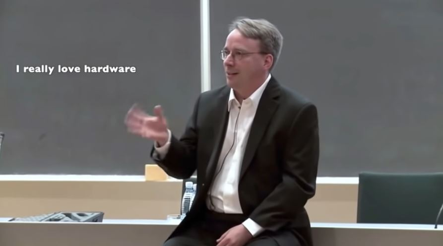
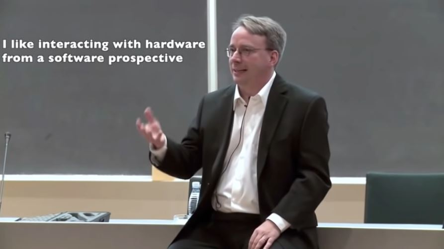
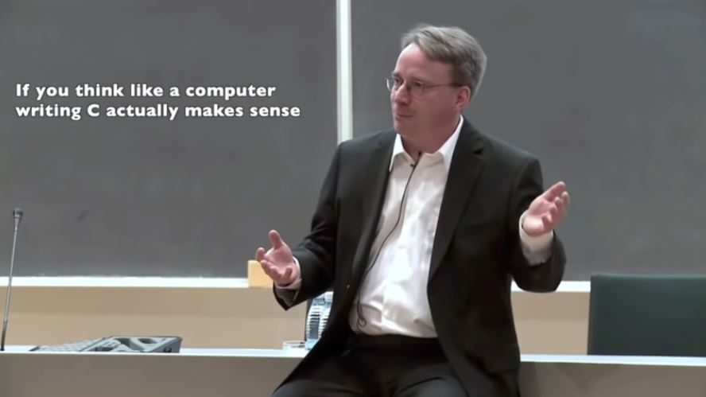

# 🐧몇 안되어서 희귀한 리누스 토발즈의 인터뷰 영상들 중 가장 재밌게 본 것들

 

TED 영상으로 시작해서 한 다섯개 정도 대학교 초청 강의나, 인터뷰 영상등을 보았는데 시간 가는 줄 모르고 너무 재밌게 봤었다. 너무 멋지신 분이라는 이유 뿐만 아니라 평소에 어떤 마인드를 갖고 살아가시는지에 대한 근본적인 궁금증이 한 몫했던 것 같다. 아무래도 짧은 영상들은 15분 이하인데 그것보다 긴 영상들이 꽤 많아서 그런 영상들은 한번 번역을 통한 정리나 요약본을 남겨두면 앞으로의 내가 한번씩 보면서 다시 의지를 되잡을 수 있지 않을까 싶어서 적어보려고 한다.

---

## Linus Torvalds Guided Tour of His Home Office

<iframe width="560" height="315" src="https://www.youtube.com/embed/jYUZAF3ePFE" title="YouTube video player" frameborder="0" allow="accelerometer; autoplay; clipboard-write; encrypted-media; gyroscope; picture-in-picture" allowfullscreen></iframe>

---

놀랍게도 유튜브에 공개된 많은 리누스 토발즈의 영상 중 가장 최근에 올라온 것들 중 하나다. 그만큼 생각보다 많은 최신 인터뷰나 보도 영상이 존재하지는 않았다. 그래도 많은 영상들 중에 이 영상이 가장 재밌고 흥미로웠다 🤣 ㅋㅋ... 뭔가 베일에 쌓여있던 것 같은 그의 사생활(?) 집안 내부을 볼 수 있고 중간중간에 나오는 그의 유머가 참 내 취향저격이다ㅋㅋㅋㅋ

 

저 런닝머신에서 걸으면서 컴퓨터 보시는게 너무 웃기다 ㅋㅋㅋ ㅋㅋㅋㅋㅋ 1mile/hr 이상으로 맞추면 마우스 작동이 마구잡이가 되어서 윈도우 종료를 못한다고 한다ㅜㅜㅋㅋㅋㅋ 컴퓨터로 주로 하는 업무는 전세계 리눅스 유저들이 보낸 이메일들 답장, 리뷰 그리고 git pull들 관리 등이 있다고 한다.

 

---

## The mind behind Linux | Linus Torvals - TED

<iframe width="560" height="315" src="https://www.youtube.com/embed/o8NPllzkFhE" title="YouTube video player" frameborder="0" allow="accelerometer; autoplay; clipboard-write; encrypted-media; gyroscope; picture-in-picture" allowfullscreen></iframe>

---

마찬가지로 부담스럽지 않은 20분 정도의 길이 영상인데, 이건 공식 사이트에만 가봐도 이미 한글 번역이 다 되어 있어서 더더욱 편하게 본 것 같다. 역시나 멋있다. 오픈 소스 관련한 그의 생각들을 엿볼 수 있는데, 어떻게 오픈 소스 문화가 지금까지의 문화로 자리잡게 되었고 체계적으로 유지되는지에 대한 이야기를 들어볼 수 있다. 정말 대단한 사람임을 또 깨달을 수 있다... 그리고 중간중간에 (역시나 내 취향) 조크를 마구마구 날려주셔서 더 재밌다!!!! 🤣🤣🤣

 

---

## Linus Torvalds talking with Aalto University students on 23 October, 2012

<iframe width="560" height="315" src="https://www.youtube.com/embed/PDEce3mtkRg" title="YouTube video player" frameborder="0" allow="accelerometer; autoplay; clipboard-write; encrypted-media; gyroscope; picture-in-picture" allowfullscreen></iframe>

---

좀 긴 영상인데, 아직 보다 말았다!!!! 중간중간에 등장하는 박스 마이크가 귀엽다 ㅋㅅㅋ... 주사위처럼 생긴 마이크인데 던져도 다치지 않으니 괜찮다 라는 무심코 툭 등장하는 그 유머가 참 재밌다....ㅎㅎㅅㅎ....

 

---

## Keynote: A conversation with Linus Torvalds의

<iframe width="560" height="315" src="https://www.youtube.com/embed/Efi9wa4Fwds" title="YouTube video player" frameborder="0" allow="accelerometer; autoplay; clipboard-write; encrypted-media; gyroscope; picture-in-picture" allowfullscreen></iframe>

---

가장 최신에 가까운 2017년 오픈 소스 리더 써밋의 리누스 토발즈 영상! 아쉽게도 댓글이 막혀있다... 댓글 보는 재미도 있는데 말이지... 🤓 ~~새롭게 알게된 TMI: 아빠랑 나이가 같으시다~~

 

---

## Linus Torvalds "Nothing Better than C"

<iframe width="560" height="315" src="https://www.youtube.com/embed/CYvJPra7Ebk" title="YouTube video player" frameborder="0" allow="accelerometer; autoplay; clipboard-write; encrypted-media; gyroscope; picture-in-picture" allowfullscreen></iframe>

---

한 학생이 묻는다.
- "운영체제를 개발하는데에 적합한 언어로 C언어 외에 다른 언어가 무엇이 있다고 생각하시나요?"
그는 이렇게 대답했다.
- "나는 다소 old-fashioned한 사람이다. 그리고 내가 리눅스나 운영체제에 관심을 갖고 시작하게된 이유는 내가 Hardware를 사랑하고, 그것들을 건드는 것에 흥미를 갖고있다. 납땜과 같은 것이 아니라 하드웨어와 소통, 상호작용하는 것을 좋아한다 - software 관점에서 말이다. 그리고 나는 아직 C언어 만큼 조금이라도 가깝게 컴퓨터처럼 생각하고 작동하는 언어를 보지 못한 것 같다."

 

다 정리하진 못했는데, 얼만큼 하드웨어 단에 oriented한 사고를 갖고 있는 지를 엿볼 수 있었던 것 같았다. 이 영상에서 나온 리누스의 대답을 보면서 머리에 한대 맞은 느낌이 들었다. 아... 나는 정말 갈 길이 멀구나...  그동안 대학교 다니면서, 갖고 있던 근본적 궁금증과 내 공부 방향을 마치 해결해 준듯한 답변이었다. 비록 몇초 언급되지 않지만, 내가 이 영상을 저학년때 접했더라면 조금 더 나은 현재의 내 모습이지 않았을까 하는 약간의 후회, 아쉬움도 들었고 그 밖에도 이 한마디에 정말 많은 생각들이 오고 간 것 같다. 소프트웨어와 하드웨어의 관계와 그 인터렉션에 대해 공부하고 싶었던 마음이 있었고 이를 위해 어떻게 해야할지에 대한 고민과 생각은 지금까지도 해결하지 못한 것 같은데, 그래도 리누스의 생각을 엿듣고 조금이나마 긍정적인 에너지와 포부를 안고 살아갈 수 있는 원동력을 얻은 것 같다. 어떻게 보면 지금이라도 이 영상을 볼 수 있었음에 감사하기도 하다! 가장 맘에 들었던 순간을 캡쳐본으로 남겼는데, **당장 내일이 계절학기 중간고사 여서** 이것과 함께 우선 글 초안은 여기서 마무리!!

 

---

 
 
