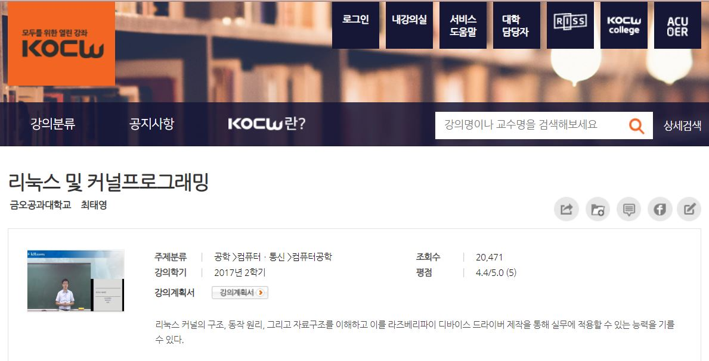
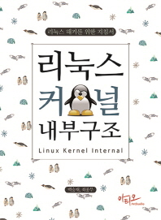
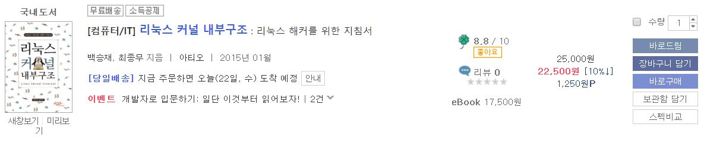

# 0강) 리눅스 및 커널 프로그래밍 공부 인트로

 

> [참고 강의 정보](#참고-강의-정보)
>
> [참고 교재 정보](#참고-교재-정보)

---

임베디드 시스템 분야에 관심 갖게 되면서 컴퓨터 구조뿐만 아니라 임베디드 분야에 유용하게 사용되는 운영체제 중 하나인 리눅스에 대해 공부해야 겠다는 마음가짐을 갖게 되었다. 아쉽게도 교내에는 개설된 관련 전공 강의가 없는 것 같아서 직접 [대학 공개 강의](https://kocw.net)을 통해 독학해보기로 했다. 쉽지 않을 내용일테도 기초 관련 지식도 부족할 수 있으나 **구글**과 함꼐라면 무엇이 두렵겠는가!! 실제로도 엄청난 구글링을 통해 나와 같은 방향으로 진로 고민하는 사람들, 학생들을 보면서 많은 힘을 얻었다. 그동안 너무 방황하고 힘들었는데 이번 기회를 통해 제대로 공부해보고 더 깊게 알아보고자 한다! 꼭 이번 학기를 통해 이 분야에 대한 나의 확신과 자심감이 더 단단해질 수 있었으면 좋겠다~~

---

 

## 참고 강의 정보 
 

 
- 모두를 위한 열린 강좌 KOCW 에서 제공되는 **리눅스 및 커널프로그래밍** 무료 강의이다. 교수님 설명도 꽤나 자세하고 쉬운 편이라 나 같은 멍청이도 이해되는데 조금 편하다! :)

 

---

 

## 참고 교재 정보 
 

    

 
- 교보문고 책쉼터에서 무료 대여해주는 **리눅스 커널 내부구조**라는 전자책이다! 기간은 14일 단위로 무료 대여가 되어서 좋다. 아직은 기초 단계라 구매는 안했지만 더 공부를 하고 나서는 진짜 책도 구매해볼 생각이다.(정말 좋은 책이다) 좋은 책들이 정말 많더라 나는 단지 우물 안 개구리였을 뿐 ㅜㅜ 모르는 내용이나 책으로 읽으면서 공부해보고 싶을때는 목차에 맞게 읽어보고 이해하고 있다!

  

---

앞으로 공부도 화이팅!! :D
