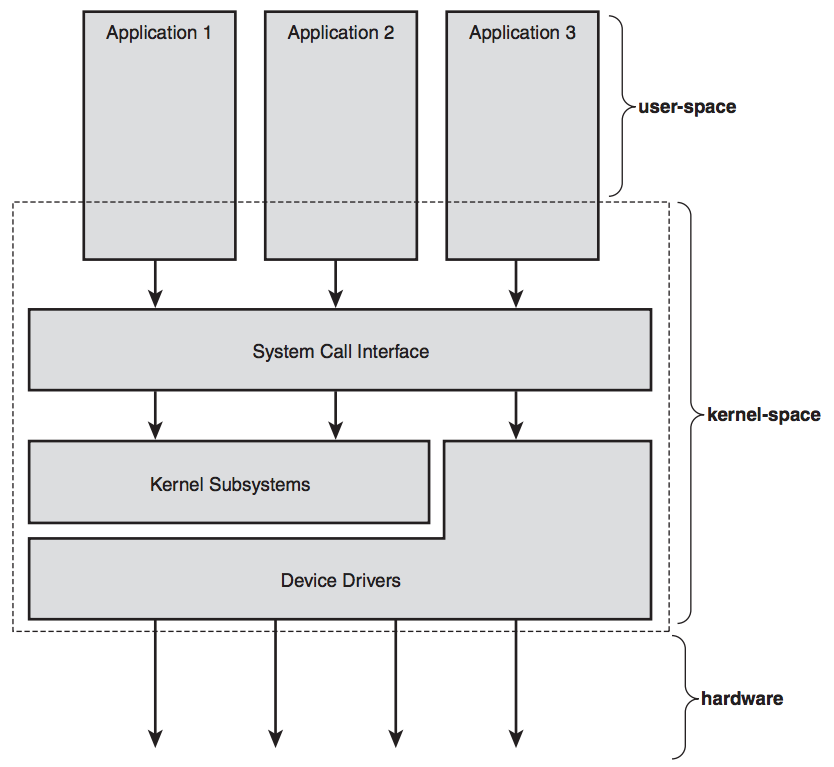

# 1장) 유닉스, 리눅스 및 리눅스 커널 개념

- 커널이란?
    - 운영체제의 핵심
- 유닉스의 일부 / 리눅스 - 공개된 운영체제 (윈도우는 제한적, ex)카이스트)
- 유닉스의 역사
    - AT&T의 연구소인 Bell Lab / C언어로 재작성 @ 1977
- 유닉스의 장점
    - 단순성
        - 수백 개의 시스템 콜 (다른 OS에 비해 상대적으로 적음)
        - 모든 객체는 파일로 인식 (시스템콜이 줄어듬)
            - open(), read(), write(), close()로 동작
        - 대부분 C언어로 작성
        - fork()를 이용하여 간단하게 프로세스 생성
        - 간단한 프로세스간 통신 PC 제공
    - 다양한 환경에서 수행
        - 수백 개의 프로세서로 된 시스템 지원
        - 소형 임베디드 시스템 (ex) raspberry pi)
- 리눅스의 개발 (Kernel)
    - 200개가 넘는 Distribution(배포판)들이 존재
    - 다양한 아키텍쳐에서 수행
    - Linux 배포판은 Linux kernel과 GNU project를 통해 개발된 시스템 소프트웨어로 구성
        - ex) 안드로이드 - 스마트폰 전용으로 구성된 배포판
- GNU GPL
    - GNU General Public License
    - 자유 소프트웨어 재단(FSF)에서만든 자유 소프트웨어 라이선스
    - 가장 강력한 copyleft
        - copyleft - 지식과 정보는 모든 사람에게 열려 있어야 함
        - copyright은 돈 주고 샀다는 의미
    - 의무
        - 변경된 소스코드는 무료로 배포해야 함
- Linux 사용률
    - 2015년 기준 안드로이드가 54.16% 차지
    - 2016년 기준 데스크탑, 랩탑 1.54% 차지
    - 2016년 기준 웹 클라이언트 수행 1.54% 차지, 안드로이드 포함시 34.02%
    - 2015년 기준 태블릿 컴퓨터에서 68%
    - 2015년 기준 서버 시장에서 35.9% (상위 천만개 웹 서버 대상)
        - 상위 백만개 대상시 98.4% (규모가 큰 서버)
    - 2016년 기준 슈퍼컴퓨터(성능 순으로 따진다)에서 99.4%
    - 2008년 기준 Mainframe(복잡한 작업 처리 컴퓨터)시장에서 28%
- 운영체제와 커널
    - 운영체제 - 기본적인 사용과 관리를 담당하는 시스템의 일부
    - 커널 - 시스템의 다른 모든 부분에 기본적인 서비스를 제공하고(제어, 분배), 하드웨어를 관리하며, 시스템 자원을 분배하는 소프트웨어
        - interrupt handler, scheduler, memory management, communication
    - Dual mode - user space & kernel space
        - 하드웨어는 kernel space에서만 접근 가능
        - system call을 통해 user application이 하드웨어의 서비스를 사용
    - Linux의 3가지 상태
        - 사용자 공간에서 프로세스의 사용자 코드 실행
        - 커널 공간에서 특정 프로세스를 위해 코드 실행
        - 커널 공간에서 인터럽트 처리
- Application - Kernel - Hardware 간의 관계
    - OS & Kernel

    

- 유휴상태란 무엇인가? (idle 상태 - 입력 대기, 아무것도 하지 않는 상태)
    - idle - user sp (X)
    - idle - ker -> syscall (X)
    - idle - ker -> inter (✔️)
    - => idle process(task) - while(1) { asm{hlt} }
        - halt는 아무것도 안하는 상태, cpu도 잡아먹지 않음
- 리눅스 커널 vs 전통적인 유닉스 커널
    - 공통점
        - monolithic static binary로 구성
        - 메모리 관리 장치(MMU) 사용
        - SMP (다양한 멀티 프로세서) 지원
    - 차이점
        - Linux는 커널을 동적으로 loading
        - preeemptive kernel
        - process(task)와 thread간에 차이가 없다
